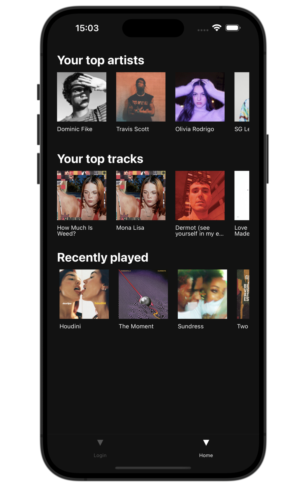
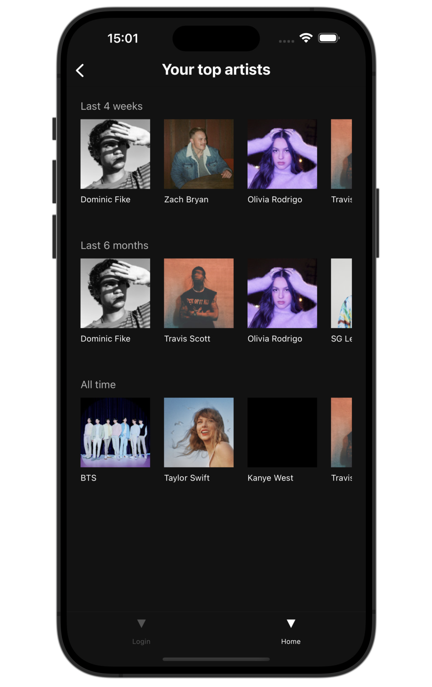
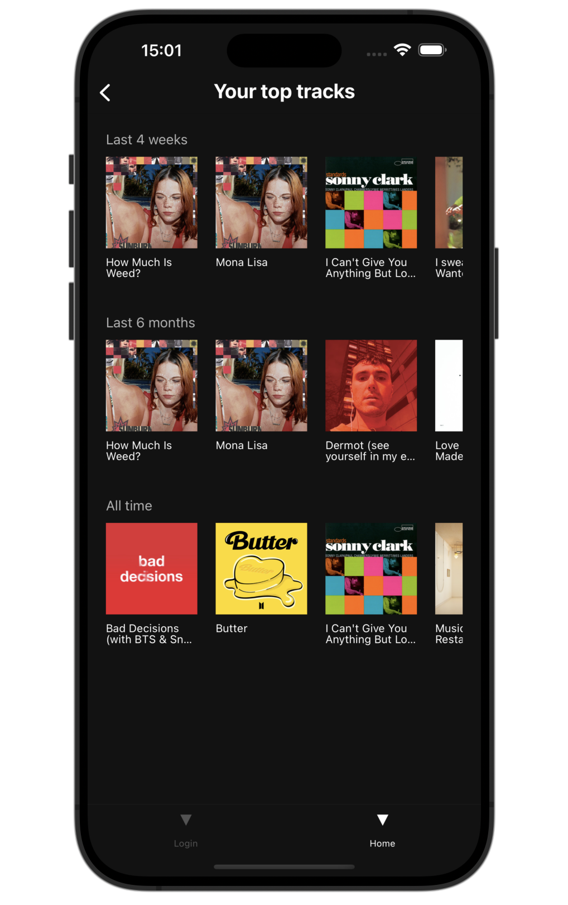

# Spotify Stats

A mobile app built with **React Native** and the **Spotify API** to display a user’s listening stats — including top artists, top tracks, and recently played music.

The app gives users a simple, visual snapshot of their music habits across different time ranges with a clean, mobile-first interface.

---

## ✨ Features

- View your **top artists** over time  
- View your **top tracks** over time  
- See your **recently played** songs  
- Scrollable, card-based UI for artists and tracks  
- Real-time data fetched from Spotify  
- Optimized for mobile use  

---

## 🛠 Tech Stack

- React Native  
- JavaScript  
- Spotify Web API  
- OAuth 2.0 Authentication  

---

## 🧠 How It Works

The app authenticates the user with Spotify and fetches listening data using the Spotify Web API.

The results are organized into:

- Top artists  
- Top tracks  
- Recently played  

Each view is optimized for quick browsing and readability, with stats broken

---

## 📱 Screenshots

  
  
  

